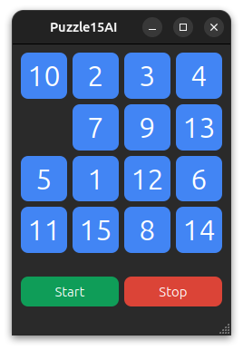

# Puzzle15AI

[](https://github.com/SajjadAemmi/Puzzle15AI/actions/workflows/python-package.yml)
[](https://github.com/SajjadAemmi/Puzzle15AI/actions/workflows/python-app.yml)

Puzzle15 AI solver with A* search algorithm, written with the Qt library using Python.



## Installation
For install the package you can run this command
```
pip3 install puzzle15ai
```

## Usage
For inference you can run this command
```
puzzle15ai
```

If you want to run the game from source code, run this command:
```
python main.py
```
If you made some changes in the `mainwindow.ui` file, you need to run the following command:
```
pyside6-uic mainwindow.ui -o ui_mainwindow.py
```
You must run `pyside6-uic` again every time you make changes to the UI file.
